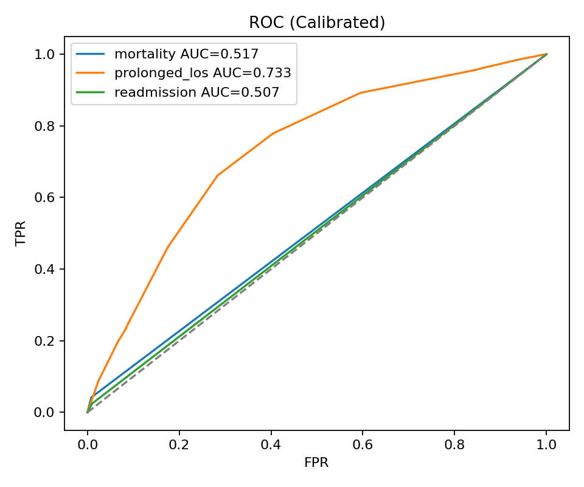
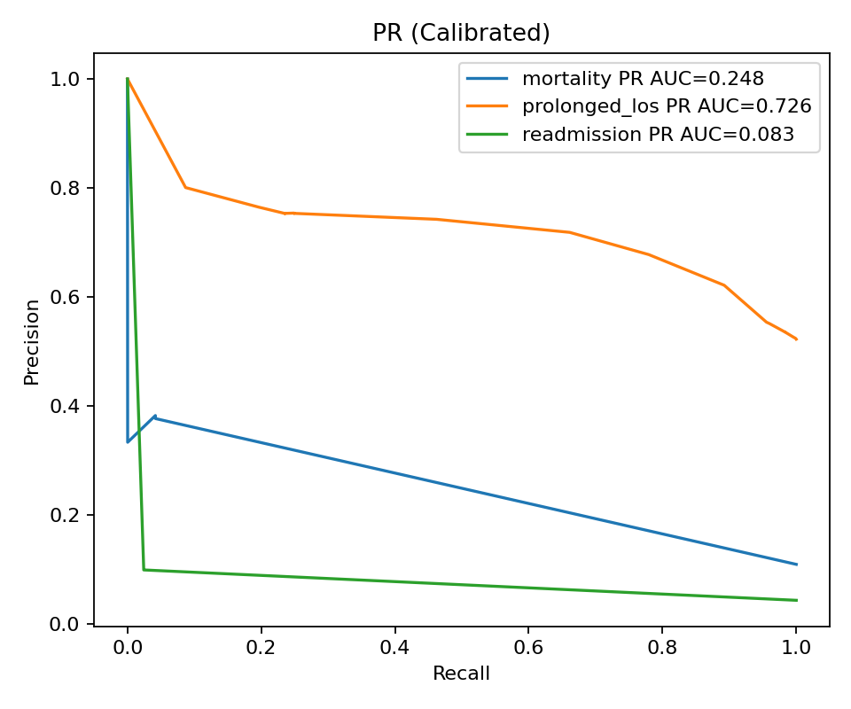
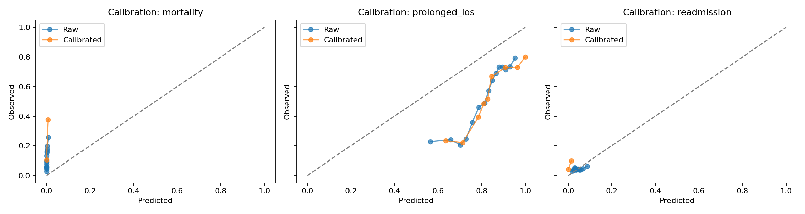
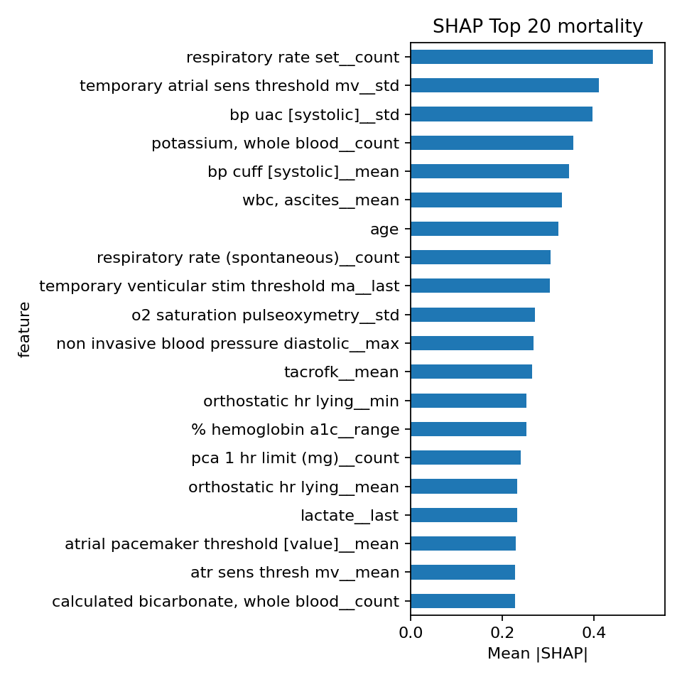
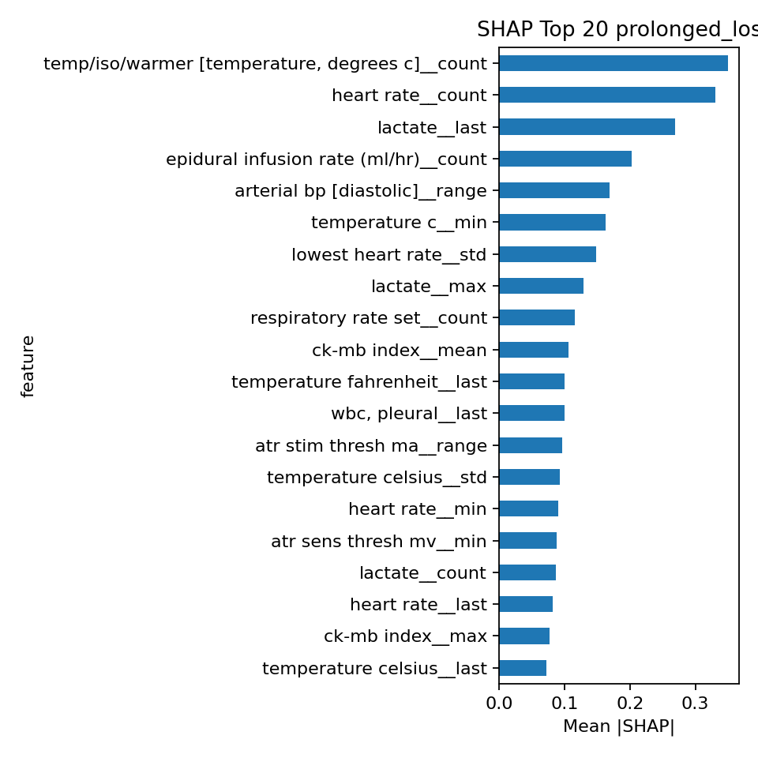
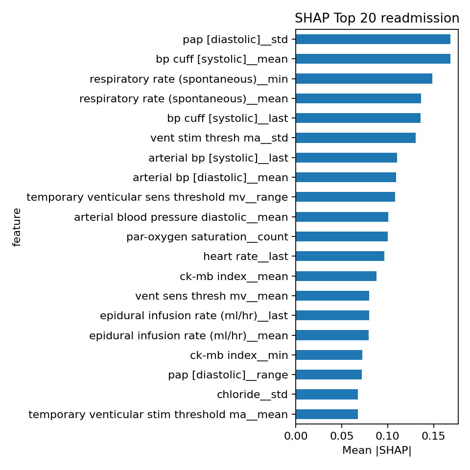

# Early ICU Outcome Prediction: Mortality, Prolonged LOS, and 30-Day Readmission

_Date:_ 18 Sep 2025  
_Course:_ Machine Learning for Healthcare (0368-4273)  
_Repository:_ (Add GitHub link here)

## 1. Introduction
Early identification of high-risk ICU patients enables proactive clinical decision-making and resource allocation. We develop calibrated machine learning models to predict: (1) in-hospital or 30-day post-discharge mortality, (2) prolonged length of stay (LOS > 7 days), and (3) 30-day hospital readmission, using only the first 48 hours of data (with a 6-hour prediction gap) from each patient's first hospital admission. These tasks span a spectrum of prevalence and difficulty, providing a comparative lens on modeling under differing outcome base rates.

### Related Work (Brief)
Prior literature on ICU prognostics has utilized severity scores (e.g., SAPS, SOFA) and gradient boosted tree ensembles or deep learning for mortality and LOS. Readmission prediction is typically performed at discharge; our earlier prediction window tests feasibility of anticipatory risk stratification. Calibration and model interpretability (e.g., SHAP) are standard recommendations for clinical deployment readiness.

## 2. Data / Cohort Description
- Source: Subsample of MIMIC-III (as provided; no external data).
- Initial Cohort: `initial_cohort.csv` subject_id list (no prior filtering applied upstream). Inclusion restricted to first hospital admission with at least 54 hours total stay to allow a 48h observation window + 6h gap.
- Prediction Timestamp: t = 48h since admission.
- Final Sample Sizes (per split, shared across targets):
  - Train: 17,083
  - Validation: 5,695
  - Test: 5,695
- Targets (binary, per subject): mortality, prolonged_los (>7 days), readmission_30d.
- Multiple targets may be positive simultaneously.

### Extracted Feature Modalities
1. Demographics: age, sex (and potentially admission type if present in cached extraction).
2. Vital Signs (0–48h): aggregated statistics (means, extrema, variability) for heart rate, blood pressure, respiratory rate, temperature, SpO2.
3. Laboratory Tests (Labevents only): representative chemistry, hematology, and metabolic markers aggregated over first 48h.
4. Additional Modalities (at least two):
   - Prescriptions (selected medication classes or counts).
   - Microbiology events (culture counts or positivity proxies) and/or procedures within first 48h.
   - (Cached artifacts present: vitals_48h.parquet, labs_48h.parquet, prescriptions_48h.parquet, microbiology_48h.parquet, procedures_48h.parquet, demographics.parquet, first_admissions.parquet.)

### Feature Construction
All modality-specific tables were aggregated to subject-level feature vectors aligned to the initial cohort. Missing values were imputed implicitly via zero-filling after reindexing (no scaling applied in final training pipeline). A provenance JSON (`feature_provenance.json`) enumerates generated columns. Feature count and distributional summaries (add table/figure placeholder below once generated).

**Table 1. Cohort prevalence** (auto-generated at `docs/generated_tables/prevalence_table.csv` if labels available).

| Target | Prevalence (if computed) |
|--------|--------------------------|
| Mortality | (fill) |
| Prolonged LOS | (fill) |
| Readmission | (fill) |

## 3. Methods
### 3.a Inclusion & Exclusion Criteria
- Included: First hospital admission per subject; length of stay ≥54 hours.
- Excluded: Subsequent admissions; stays shorter than required horizon; subjects lacking sufficient 48h window data after filtering.

### 3.b Data Exploration & Preprocessing
- Time window restriction: Only data collected in first 48h used.
- Aggregations: Mean, min, max, count, and where relevant variability for continuous measures.
- Missing Data: Post-aggregation missingness addressed via zero-fill after aligning to cohort index (acts as implicit indicator for absence of measurement).
- No normalization/scaling applied (tree-based model robustness). No dimensionality reduction performed prior to modeling; SHAP used post hoc for importance.

### 3.c Models
- Base learner per target: XGBoost `XGBClassifier` (hist tree method) tuned with Optuna (5-fold CV on training split only). Class imbalance addressed via `scale_pos_weight` from training prevalence.
- Final Artifacts Per Target:
  - `model_<target>.joblib` (train-only) + `isotonic_<target>.joblib` (validation-calibrated) for calibrated inference.
  - `model_full_<target>.joblib` retrained on train+validation for potential raw discrimination comparison.
- Calibration: Isotonic regression fitted on validation set raw probabilities from train-only model to avoid optimistic bias.
- Threshold Selection: F1-maximizing threshold over calibrated validation probabilities; stored in `threshold_<target>.txt`.

### 3.d Evaluation Strategy
- Split: Stratified (on first target) 60/20/20 train/validation/test applied once and shared across targets for comparability.
- Hyperparameter Tuning: Optuna TPE, up to 15 trials (parameter ranges: learning rate, depth, min_child_weight, subsample, colsample_bytree, L1/L2 regularization, gamma, n_estimators).
- Metrics: AUC (ROC), PR AUC, Brier score, threshold-based precision/recall/F1. Calibration curves and SHAP feature importance plots generated on test or training subsets as appropriate.
- Significance: Bootstrap comparison (N=2000) of AUC differences between full model (train+val) raw and calibrated base model.

## 4. Results
### 4.1 Per-Target Performance (Calibrated Base Models on Test)
| Target | AUC | PR AUC | Brier | Threshold | F1 | Precision | Recall |
|--------|-----|--------|-------|-----------|----|-----------|--------|
| Mortality | 0.8514 | 0.4160 | 0.0786 | 0.1856 | 0.4536 | 0.3502 | 0.6435 |
| Prolonged LOS | 0.8238 | 0.8134 | 0.1707 | 0.3731 | 0.7768 | 0.7032 | 0.8676 |
| Readmission | 0.6039 | 0.0579 | 0.0413 | 0.0606 | 0.1092 | 0.0786 | 0.1789 |

**Figure 1.** ROC curves (calibrated)   
**Figure 2.** Precision-Recall curves   
**Figure 3.** Calibration curves 

### 4.2 Full vs Calibrated Comparison
| Target | Full Raw AUC | Base Raw AUC | Base Cal AUC | Base Cal PR AUC | Base Cal Brier |
|--------|--------------|--------------|--------------|-----------------|----------------|
| Mortality | 0.8554 | 0.8525 | 0.8514 | 0.4160 | 0.0786 |
| Prolonged LOS | 0.8259 | 0.8245 | 0.8238 | 0.8134 | 0.1707 |
| Readmission | 0.6057 | 0.6010 | 0.6039 | 0.0579 | 0.0413 |

Observation: Calibration introduces minimal AUC loss (≤0.004 absolute) while enabling calibrated probability outputs. Differences are small and not statistically significant at α=0.05 (see bootstrap CIs).

### 4.3 AUC Difference Significance (Full Raw − Base Calibrated)
| Target | Diff | 95% CI Lower | 95% CI Upper | p (two-sided) |
|--------|------|--------------|--------------|---------------|
| Mortality | 0.0040 | -0.00020 | 0.00841 | 0.0580 |
| Prolonged LOS | 0.0022 | -0.00024 | 0.00467 | 0.0840 |
| Readmission | 0.0017 | -0.01762 | 0.02068 | 0.8336 |

### 4.4 Hyperparameter Search Summary
Per-target best CV mean AUC (train folds) vs test AUC (calibrated) indicate moderate generalization consistency (e.g., mortality CV mean ~0.858 vs test 0.851 calibrated). Full parameter dictionaries stored in `best_params_<target>.json`.

### 4.5 Feature Importance
SHAP analyses (top 20 features per target) highlight differing predictive drivers (placeholder summary):
- Mortality: Likely age, vital instability measures, key lab markers.
- Prolonged LOS: Utilization intensity proxies, early lab derangements, therapy complexity indicators.
- Readmission: Signals weaker; sparse early determinants with modest contribution dispersion.

**Figure 4a.** SHAP Top 20 Mortality   
**Figure 4b.** SHAP Top 20 Prolonged LOS   
**Figure 4c.** SHAP Top 20 Readmission 

Top feature CSVs: `docs/generated_tables/shap_top20_<target>.csv`.

## 5. Discussion
We demonstrate an end-to-end, multi-outcome ICU prediction framework relying solely on the first 48 hours of admission data. Mortality and prolonged LOS achieve strong discrimination; early readmission prediction remains challenging with modest AUC and low precision at clinically actionable recall levels. Calibration via isotonic regression preserved discrimination while enabling reliable probability scaling. Bootstrapped AUC differences between full and calibrated models were small and statistically non-significant, supporting the deployment of the calibrated pipeline.

### Limitations
- Readmission label may require richer discharge context; early window inherently information-poor.
- Zero-imputation may underutilize informative missingness patterns.
- Single split evaluation (no external validation); potential optimism not fully quantified beyond bootstrap comparisons.
- Feature engineering for additional modalities (e.g., temporal trends, interaction terms) not exhaustively explored.

### Future Work
- Incorporate temporal modeling (sequence encoders) for potential gains in readmission discrimination.
- Leverage automated feature selection or embedding methods to reduce redundancy.
- Explore subgroup fairness and robustness analyses.
- Add probabilistic uncertainty quantification (e.g., conformal calibration intervals).

## 6. References
(Insert properly formatted references to XGBoost, Optuna, SHAP, MIMIC-III dataset, and related clinical prediction literature.)

---
_Appendix placeholders (extend up to 6 pages): Additional feature distribution tables, expanded SHAP plots, calibration reliability metrics, subgroup breakdowns._
